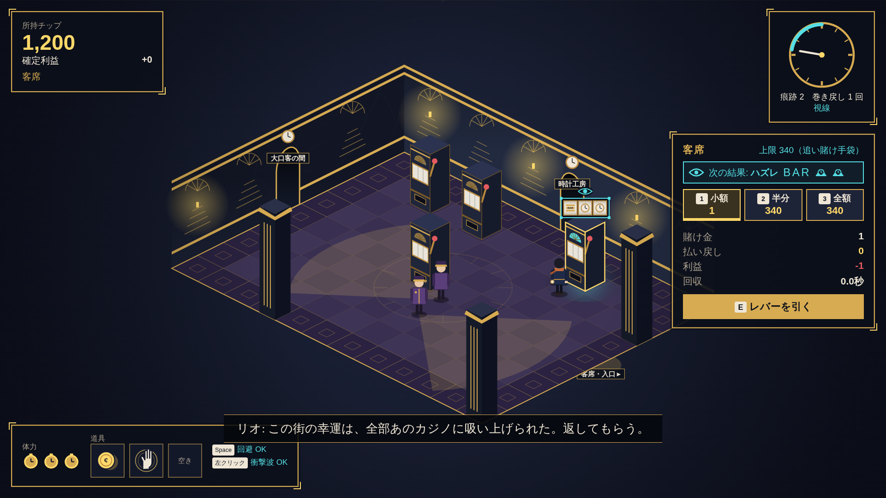

# 未来泥棒 — TOMORROW THIEF

> 大当たりを見てから時間を戻し、全財産を賭け直せ。
> 未来をカンニングして、カジノを破産させるローグライト。
> ただ一人、支配人だけは、あなたが消した時間を覚えている。

時間操作 × カジノ攻略 × 強盗アクションのローグライト（PC・1人用）。第1・第2段階の試作（1フロア）。



## 起動方法

Node.js 22 以降が必要です。

```sh
cd tomorrow-thief
npm install
npm run dev        # http://localhost:5173 をブラウザ（Chrome / Edge 推奨）で開く
```

- 配布用のビルド: `npm run build` → `dist/` を静的サーバーで開く（`npm run preview`）
- テスト: `npm test`（時間操作のルールの検証）・型チェック: `npm run typecheck`
- 画面は 1920×1080 基準で、ウィンドウに合わせて拡大縮小します

## 操作方法

| キー         | 操作                                       |
| ------------ | ------------------------------------------ |
| WASD         | 移動（W+D・W+A・S+D・S+A で壁に沿ってまっすぐ進む） |
| E            | 台を操作（レバー／受け取る）・窓口で持ち帰る |
| 1 / 2 / 3    | 賭け金: 小額・所持金の半分・全額           |
| Q            | 確定前の抽選を巻き戻す                     |
| Space        | 回避ステップ（短いあいだ無敵）             |
| マウス左     | 時計の衝撃波（警備を押し返す・支配人を減速） |
| Esc          | ポーズ（支配人も止まる）                   |

## 遊び方

部屋の行き来: 扉は奥の壁（札に行き先）と手前の床（金の光と札）にあります。扉の前で壁に向かって押し込むと隣の部屋へ。
奥右の扉へは **W+D**、奥左の扉へは **W+A** がまっすぐです（扉の近くで壁を押せば扉の方へ滑ります）。

1. 入口の奥の「壊れた台」で1枚賭ける → 777 → **Q で巻き戻す** → 全額で賭け直す → 1,000 チップ
2. 時計工房で道具を買う（最大3つ）。予知した台には目の印と次の絵柄が出る
3. 台に1枚賭けて未来を覗き、巻き戻して賭け金を決め直す。当たりは「受け取る」で確定し、払い出し口の近くで回収する
4. 巻き戻すほど・大きく当てるほど「痕跡」が増え、支配人ミスター・ノクスが近づく（時計の異変 → 視線 → 足音 → 出現）
5. 搬出ロビーの窓口で持ち帰れば成功。捕まると、持ち帰っていない利益と道具を失う（退避用の領収書の分は残る）
6. 持ち帰った合計で、時計工房の品揃え（退避用の領収書・白紙の契約）が解放される

## 時間操作のルール（`src/core/run.ts`・`test/core.test.ts` で検証）

- 台は挑戦開始時にシードを持ち、抽選位置ごとの結果は（シード, 位置）だけで決まる。賭け金・道具では変わらない
- 抽選開始の直前を巻き戻し地点として記録する（所持チップ・主人公・通常の警備）
- 結果を見た後、「受け取る」まで巻き戻せる。巻き戻すと支出と仮の払い出しが戻る
- 巻き戻しても、知った結果・巻き戻した回数・痕跡・支配人の位置と追跡は残る（巻き戻しのあいだも支配人だけは歩き続ける）
- 受け取ると台の抽選位置が1つ進み、もう巻き戻せない（同じ利益を二重に受け取れない）
- 結果を確定するか巻き戻すまで、部屋を出られない。最初の2回の巻き戻しは痕跡を残さない

## 抽選表（通常台。`src/config/balance.ts`。表示と抽選は同じ表を参照）

| 結果     | 出現率 | 払い戻し（元金込み） |
| -------- | -----: | -------------------: |
| ハズレ   |    60% |                  0倍 |
| 小当たり |    25% |                1.5倍 |
| 中当たり |    10% |                  3倍 |
| 大当たり |     4% |                 10倍 |
| 777      |     1% |                100倍 |

払い戻しは整数（切り捨て）。台の操作パネルで、賭け金・払い戻し・利益・回収時間を別々の行で表示します。

## 実装済みの範囲

- **第1段階**: 部屋・スロット・主人公・巻き戻し（逆再生の演出）・賭け金の変更（小額／半分／全額）・結果の確定と回収
- **第2段階（1フロア）**
  - 部屋: 入口の客席 → 分岐する客席A・B → 時計工房（安全地帯・支配人は入らない）→ 大口客の間 → 搬出ロビー。大口客の間へ直通する客席は挑戦ごとに変わる
  - 挑戦ごとに変わるもの: 台の結果・賭け金上限・警備の巡回路・店の品
  - 道具6種: 秒針ブーツ・追い賭け手袋・割れた鏡・残響コイン・退避用の領収書・白紙の契約
  - 警備2種: 巡回警備（視界の扇。巻き戻しの直後や大口の回収中に見られると追ってくる）・用心棒（持ち場の近くの怪しい客に詰め寄る）
  - 支配人ミスター・ノクス: 痕跡で段階的に予告（時計の異変 → 視線 → 足音 → 出現）。部屋をまたいで追ってくる。隣の部屋から来るときは扉が赤く光り、足音が鳴る。入ってすぐは捕まえない
  - 記録（持ち帰った合計・挑戦回数など）と設定（音量3種・画面の揺れ・閃光・残像）を保存
- 演出: 777 は「静けさ → 重い確定音 → 金管 → 金貨」（大金の初回は約4秒、以降は短く）。払い出し中も移動・回避・衝撃波は使える
- 音: すべて Web Audio API で合成（ピアノ風の和音・控えめな金管・ブラシ・遠くの時計の音、各効果音）

## 未実装の範囲

- 3フロア構成と最終の「所有権の間」（正式な契約で支配人を止める・看板の名前が変わり朝日が差す結末）。現在の目標表示は「所有権まで あと○○」のみ
- 本番の美術（メインビジュアル・立ち絵4方向×表情・支配人3方向・筐体の画像・部屋の分割素材・512px の道具アイコン）。現在はすべてコードで描いた仮素材
- 人物の動作のうち「時計を開く」「捕獲」の専用アニメーション（待機・歩行・回避は簡易表現）
- ゲームパッド操作・キー割り当ての変更・英語版

## 使用素材

外部の画像・音声素材は使っていません（フォントのみ同梱）。

- フォント: 漢字を日本の字形で表示するため、日本語フォントを同梱（`src/assets/fonts/`・SIL Open Font License 1.1・`OFL.txt`）
  - 見出し・作品名: しっぽり明朝（Shippori Mincho）／本文・金額: 禅角ゴシック New（Zen Kaku Gothic New）
  - ゲームで使う文字だけに絞っている。文言を変えたら `PYFTSUBSET=<pyftsubset のパス> node scripts/fonts.mjs` で作り直す（`pip install fonttools brotli`。収録漏れはテストで分かる）

- 絵: すべて Canvas 2D / SVG でコードから描画（`src/render/sprites.ts`・`src/render/room.ts`・`src/ui/icons.ts`）
- 音: Web Audio API で合成（`src/audio/audio.ts`）
- 色: パレットは `src/render/palette.ts`（CSS は `src/style.css` の変数に同じ値）
- 文言: `src/strings.ts`、数値: `src/config/balance.ts`

## 確認用の映像

`docs/check-clip-15s.webm`（約14秒）:
1枚で777 → 巻き戻し → 全額で777 → 大量の金貨と回収 → 逆再生する警備の中を、支配人だけが普通に歩いてくる。

## ファイル構成

```
src/config/balance.ts   数値（抽選表・速さ・道具の効果など）
src/core/               ゲームの規則（描画に依存しない。テスト対象）
  slot.ts               抽選（シード＋位置で決まる）・払い戻し
  items.ts              道具・払い出しの内訳
  floor.ts              フロアの生成（部屋・台・警備・店）
  run.ts                挑戦の進行（巻き戻し・回収・警備・支配人）
src/render/             等角投影の描画・粒子・パレット
src/ui/                 HUD・台の操作パネル・店・メニュー
src/audio/audio.ts      合成音
src/main.ts             入力・ゲームループ・画面遷移
```
